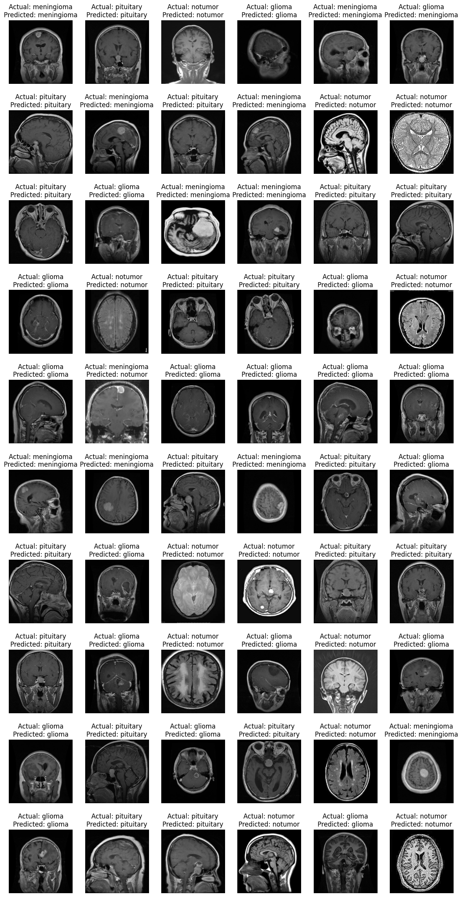

#### Overview

Built a model to classify MRI images of the human head as having a specified type of tumor or not. The 4 classes are; "Meningioma", "Glioma", "Pituitary" and "No tumor". The dataset is obtained from kaggle [Brain Tumor MRI Dataset](https://www.kaggle.com/datasets/masoudnickparvar/brain-tumor-mri-dataset). The data is made up of four directories for the four classes.

#### Model

Image preprocessing via flipping, rescaling, normalising, zooming and rotation is applied to the train set only. The Resnet50 and Efficientnet pretrained model is used for training, the last layer is changed to reflect the number of classes.
The model has three versions, the first two versions are trained with the Torch library and uses efficientnet and Resnet50 as their pretrained layers. The third uses tensorflow with no pretrained layer.

------------------------------------------------------------------------------------------------------------------------------------------------------------------------------------------------------------------------------------------

The accuracy of training and testing sets for version 1 after 15 epochs is 98.9% and 98.1% respectively with losses of 0.031 and 0.083.

Version 3 after 30 epochs of training had 86.9% and 84.8.1% accuracy and losses of 0.3435 and 0.2842 for both the training and testing sets respectively.

------------------------------------------------------------------------------------------------------
The model predicted 758 of 802 images correctly when run on a separate directory of mri images.

 
 
 

<picture>
 <source media="(prefers-color-scheme: dark)" srcset="output.png">
 <source media="(prefers-color-scheme: light)" srcset="output.png">
 
</picture>

Running any of the 'main' files works.

